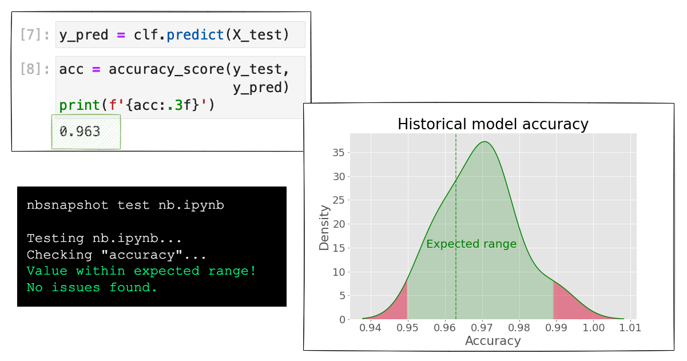

# nbsnapshot

CLI for doing snapshot testing on Jupyter notebooks. [Blog post here.](https://ploomber.io/blog/snapshot-testing/)



> **Note**
> `nbsnapshot` is in an early stage of development. Join our [community](https://ploomber.io/community) to submit your feedback and follow me on [Twiter](https://twitter.com/intent/user?screen_name=edublancas) to get the latest news.

## Install

```sh
pip install nbsnapshot
```

## Documentation

[Click here to see the documentation](https://nbsnapshot.readthedocs.io)

## Use Cases

* [Testing example notebooks](https://nbsnapshot.readthedocs.io/en/latest/use-case-nbs.html)
* [Machine Learning model re-training](https://nbsnapshot.readthedocs.io/en/latest/use-case-ml.html)
* [Data ingestion monitoring](https://nbsnapshot.readthedocs.io/en/latest/use-case-data.html)

## Usage

First, [tag some cells](https://papermill.readthedocs.io/en/latest/usage-parameterize.html). 

Or, get a sample notebook:

```sh
curl -O https://raw.githubusercontent.com/ploomber/nbsnapshot/main/examples/normal.ipynb
```

Then, run the notebook and test it (pass `--run` to run the notebook before doing the snapshot test):

```sh
# install dependencies
pip install matplotlib numpy pandas

# run test
nbsnapshot test normal.ipynb --run
```

*Note:* You'll need to run the command a few times to start generating the history. If you want to fail the test, modify the notebook and add replace the cell that contains `np.random.normal()` with the number `100`.


## About Ploomber

Ploomber is a big community of data enthusiasts pushing the boundaries of Data Science and Machine Learning tooling.

Whatever your skillset is, you can contribute to our mission. So whether you're a beginner or an experienced professional, you're welcome to join us on this journey!

[Click here to know how you can contribute to Ploomber.](https://github.com/ploomber/contributing/blob/main/README.md)


## Telemetry

We collect optional, anonymous statistics to understand and improve usage. For details, [see here](https://docs.ploomber.io/en/latest/community/user-stats.html)
